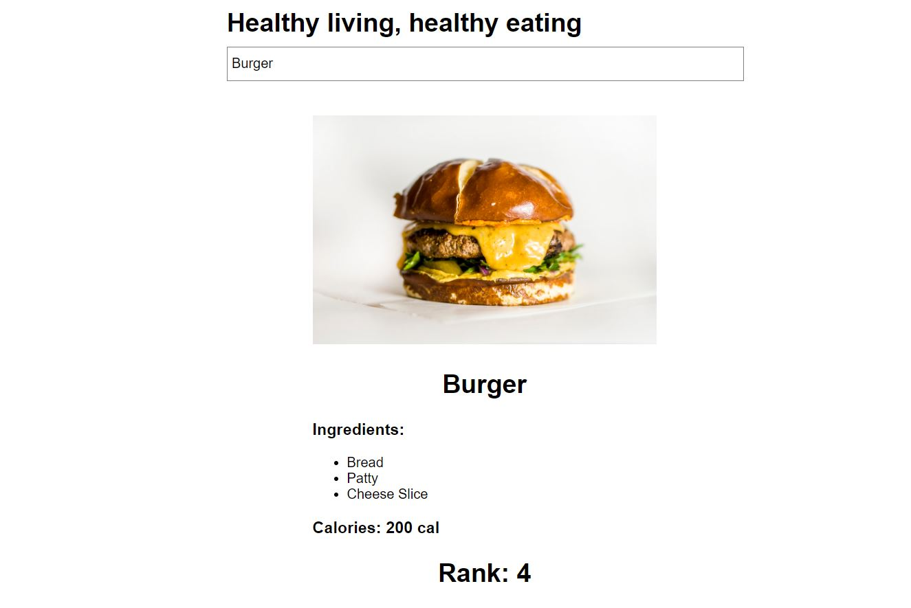

# [Healthy Living, healthy eating](http://opposite-wine.surge.sh/)



> A front end app created using React to search and display details about food items.

---

### Table of Contents

- [Description](#description)
- [Installation](#installation)
- [License](#license)
- [Info](#info)

---

## Description

This assignment is catered towards invoking healthy habits in this world where rising levels of junk food, fast food, and unhealthy drinks are causing obesity and giving rise to many diseases in populations all across the world. 

Have a look at the Live version [here](http://opposite-wine.surge.sh/).

#### Technologies

- React

---

## Installation

#### `Step 1` - Clone the repo

```bash
$ git clone https://github.com/roheat/indorse-healthy.git
```

#### `Step 2` - cd in the repo

```bash
$ cd indorse-healthy
```

#### `Step 3` - Install dependencies

```bash
$ npm install
```

#### `Step 4` - Run application

```bash
$ npm start
```

In browser, open [http://localhost:3000](http://localhost:3000)

---

## License

MIT © [roheat](https://github.com/roheat)

---

## Info

- Website - [roheat.com](https://roheat.com)
- Twitter - [@roheatdotcom](https://twitter.com/roheatdotcom)
- LinkedIn - [Rohith Srivathsav](https://www.linkedin.com/in/rohith-srivathsav/)
